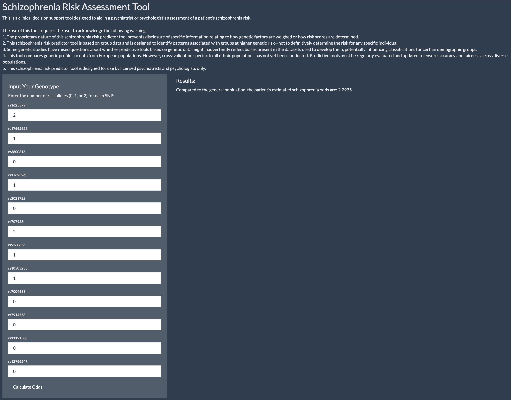

# Introduction

Schizophrenia is a severe psychiatric disorder that alters an individual’s thoughts, emotions, and behaviors. (Jauhar et al., 2022) Its symptoms, including delusions, hallucinations, disorganized thinking, and impaired functioning, often emerge in early adulthood and can result in long-term disability. Beyond the personal toll, individuals with schizophrenia frequently encounter social stigma and discrimination, which exacerbate their isolation and restrict life opportunities. (Mannarini et al., 2022) Misconceptions about schizophrenia, such as the stereotype linking it to violence, contribute to this stigma. While the majority of individuals with schizophrenia are not violent, studies suggest that certain risk factors like substance abuse, lack of access to psychiatric care, and acute psychotic episodes may elevate an individual's likelihood of violence in a small subset of cases. (Fazel et al., 2009)

The exact causes of schizophrenia remain unclear, but a combination of biological and environmental factors is widely believed to play a role. (Jauhar et al., 2022) Advances in genome-wide association studies (GWAS) have provided a powerful tool for identifying the genetic underpinnings of the disorder. (Uffelmann et al., 2021) GWAS identifies genetic variants that are associated with a specific disease or condition. It has the potential to inform early detection, intervention strategies, and the development of targeted therapies. One of the most tangible outcomes of GWAS is the creation of polygenic risk scores (PRS), which can help estimate an individual's genetic predisposition for a disease or condition given their individual genetics. (Martin, 2018) However, the application of PRS to schizophrenia raises significant ethical concerns. These considerations will be explored in the context of Ripke and colleagues’ GWAS paper, *“Genome-wide association study identifies five new schizophrenia loci.”* (Ripke et al., 2011)

# Analysis of Methods

## Review of Methedology

This study used genome-wide association analyses to identify genetic variants (single nucleotide polymorphisms, or SNPs) associated with schizophrenia in individuals of European ancestry. Data from 17 previous studies (9,394 cases, or individuals with the disease, and 12,462 controls, or individuals without the disease) were rigorously cleaned through quality control measures to exclude rare variants, genome sequencing errors, and family members that could genetically confound results. Statistical techniques, including principal component analysis and logistic regression, accounted for population-level genome variation. Findings were validated in an independent dataset of 8,442 cases and 21,397 controls, and imputation was used to predict unmeasured variants. This two-stage design verifies whether the significant SNPs identified in the stage one analysis maintain their association when tested on independent, unseen data. The study identified new genetic variants associated with schizophrenia. Replication confirmed these associations and supported a polygenic model of inheritance for schizophrenia, meaning that a combination of multiple genes are ultimately responsible for an individual experiencing schizophrenia, rather than an issue with one single gene. (Ripke et al., 2011)

The identification of new genetic variants associated with schizophrenia allows for the creation of schizophrenia PRS. However, for these PRS to be valid, the underlying information in the PRS must come from a study that is well designed and truly generalizable to broad populations. (Martin, 2018)

### Merits

The methodology in this study is generally rigorous and well-structured. The researchers pooled data from 17 datasets across 11 countries, focusing on individuals of European ancestry to reduce the risk of confounding effects from population structure, which occur when genetic differences between ancestries falsely appear linked to the condition. This large dataset, comprising 21,856 individuals (9,394 cases with schizophrenia and 12,462 controls without schizophrenia), provided sufficient sample size to detect genetic differences. The validation phase in the second stage tested findings in an independent sample of 8,442 cases and 21,397 controls, reinforcing the reliability of the results. 

Quality control was detailed and systematic. Rare genetic variations (SNPs present in fewer than 5% of individuals) were excluded to maintain generalizability to the broader population. SNPs missing data in more than 2% of individuals were also excluded to avoid bias. The researchers used reference data from the HapMap Project, a widely used resource for mapping common genetic variations, to remove SNPs with significant frequency deviations. Hardy-Weinberg equilibrium testing ensured that SNPs followed expected patterns of genetic variation in a general population, and SNPs that were highly correlated with other SNPs were excluded to focus on independent genetic signals. These steps ensured a reliable dataset of 11,310 SNPs for further analysis.

When examining the association between SNPs and schizophrenia status, a stringent threshold for statistical significance far below the typical $\alpha = 0.05$ was applied. This was done to reduce the risk of false-positive findings, which was especially critical given the large number of tests performed. The replication phase in Stage Two was a key aspect of the study. Testing significant SNPs in an independent sample and combining results using meta-analysis strengthened the findings by ensuring consistency across datasets. 

The large sample size, extensive quality control, and validation steps in this study provide strong credibility to the validity of the identified SNPs, indicating support towards their use in creating accurate PRS for schizophrenia. (Martin, 2018; Ripke et al., 2011)

### Demerits

The study’s focus on individuals of European ancestry, while methodologically convenient for minimizing confounding due to population structure, introduces significant limitations that undermine the generalizability and broader applicability of its findings outside of European individuals.

Genetic variation is not uniformly distributed across populations. (Popejoy & Fullerton, 2016) Instead, different racial and ethnic groups have distinct patterns of genetic variation shaped by evolutionary history. By focusing exclusively on individuals of European ancestry, the study captures only a subset of genetic diversity, potentially missing important schizophrenia-associated variants that may be more common or even unique to other populations. Consequently, any SNPs identified as significantly associated with schizophrenia in this study may not apply to individuals of non-European ancestry. This limitation is especially problematic for a condition like schizophrenia, which impacts individuals of all racial and ethnic backgrounds. (Fazel et al., 2009)

Furthermore, genetic variants identified in one population often have different allele frequencies or effect sizes in other populations. (Huang et al., 2015) A variant that strongly influences schizophrenia risk in European populations may have a negligible or even opposite effect in individuals from African, Asian, or Indigenous populations. Thus, the study’s findings may fail to replicate in non-European populations, further limiting their utility for broader understanding and applications. (Popejoy & Fullerton, 2016)

The lack of racial diversity has critical implications for the development of PRS. These scores aggregate the effects of multiple genetic variants to estimate an individual’s risk of developing a condition, but their accuracy depends heavily on the population in which the underlying genetic associations were identified. PRS derived from European-ancestry data have been shown to perform poorly when applied to non-European populations. For example, studies have found that PRS for various conditions are significantly less predictive in individuals of African ancestry compared to those of European ancestry. (Duncan et al., 2019)

Considering that 17 different studies and tens of thousands of individuals were pooled for this analysis, it is disappointing that the authors did not make an effort to validate the findings from the European population analysis on more diverse populations. Such validation would have offered valuable insights into the applicability and relevance of the study’s findings for non-European individuals.

In this study, the exclusive use of European-ancestry data to identify schizophrenia-associated SNPs means that any resulting PRS will likely be less accurate for individuals of non-European descent. This limitation will likely significantly reduce accuracy of PRS generated for non-European individuals. Overall, the results of the study should not be used to make inference about schizophrenia risk in non-European populations.

# Creation of a Novel Polygenic Risk Score Calculation Tool

The Schizophrenia Risk Assessment Tool is an innovative application of genomic research to assess genetic predisposition to schizophrenia. Inspired by the COMPAS risk assessment system, which is widely used in the criminal justice system to assess a potential parolee's likelihood of recidivism, this tool adapts similar principles to psychiatric genetics, focusing on transparency and ethical considerations. (Engel & Grgić-Hlača, 2021) It combines data from significant SNPs identified through rigorous GWAS methods with a user-friendly interface designed in R using Shiny. By calculating a PRS based on genotype input, this tool enables mental health professionals to incorporate genetic data into clinical decision-making.

You can access the tool at [https://neel-i-singh.shinyapps.io/schizophreniariskassessmenttool/](https://neel-i-singh.shinyapps.io/schizophreniariskassessmenttool/)

**Figure One: ** Schizophrenia Risk Assessment Tool demonstrating a patient's schizophrenia odds based on number of risk alleles.

## Novelty

The novelty of this tool lies in its integration of validated genetic findings with an accessible interface that supports clinical decision-making while acknowledging the limitations of predictive genetics. Currently, PRS are not widely used clinical decisionmaking due to inaccessibility of genomic sequencing and the fact that the predictive power of PRS is not yet enough for PRS to act as an independent diagnosis tool. (Calafato et al., 2018) However, its use as a proof of concept tool to inform schizophrenia diagnosis is explored through this tool.

## How the Tool Works

The tool calculates a PRS using inputted genotype data. An individual carries two alleles, or copies of a gene (one from the mother and one from the father). (Uffelmann et al., 2021) Thus, an individual can have 0, 1, or 2 copies of an allele containing a SNP associated with schizophrenia. The PRS is a weighted sum of the genotypes for the included SNPs, where each genotype (0, 1, or 2 risk alleles) is multiplied by the logarithm of the SNP’s odds ratio. The formula for the PRS is as follows:

$$PRS = \exp(\sum_{i=1}^{n} genotype_i \times \ln({OR}_i)$$

In this formula

-   $genotype_i$ is the number of risk alleles (0, 1, or 2) for SNP $i$

-   $\ln({OR}_i)$ is the natural logarithm of the odds ratio for SNP $i$

-   $n$ is the total number of SNPs that are used by the calculator

The tool calculates a log-odds PRS by summing the weighted contributions of each SNP and then exponentiates the result to convert the score back into odds. SNP identifiers begin with "rs". For example, if a patient has one risk allele for rs1625579 (OR = 1.12) and two risk alleles for rs17662626 (OR = 1.20), the log-odds contribution for these SNPs would be $\ln(1.12) \times 1 + \ln(1.20) \times 2$. This value is then added to the contributions from other SNPs to compute the total risk score, which is transformed into a final odds ratio indicating the patient’s relative risk compared to the general population. (Martin, 2018)

From Ripke et al., SNPs that met the author-identified $p < 5 \times 10^8$ significance threshold after both stage one and stage two analysis were included in this calculator. This was the most stringent level of validation the authors performed, meaning that the SNPs included in the calculator meet the highest level of significance. There were 12 SNPs meeting this criteria, thus $n=5$ for this calculator. The authors provided the odds ratio and $p$ values for all SNPs, which were incorporated into the calculator. (Ripke et al., 2011)

## Interface

The tool was developed in R using the Shiny package. The interface is designed to be intuitive, enabling licensed mental health professionals to input genotypes for 12 SNPs and receive a calculated odds ratio. 

The COMPAS recidivism prediction algorithm, another predictive model, was mandated by the Supreme Court of Wisconsin to include a set of five warnings for potential users. This was meant to inform the user of potential limitations of the algorithm. Inspired by COMPAS, the tool features warnings contextualized for schizophrenia prediction. (Engel & Grgić-Hlača, 2021) 

These include:

1.  The proprietary nature of this schizophrenia risk predictor tool prevents disclosure of specific information relating to how genetic factors are weighed or how risk scores are determined.

2.  This schizophrenia risk predictor tool is based on group data and is designed to identify patterns associated with groups at higher genetic risk—not to definitively determine the risk for any specific individual.

3.  Some genetic studies have raised questions about whether predictive tools based on genetic data might inadvertently reflect biases present in the datasets used to develop them, potentially influencing scores for certain demographic groups.

4.  This tool compares genetic profiles to data from European populations. However, cross-validation specific to all ethnic populations has not yet been conducted. Predictive tools must be regularly evaluated and updated to ensure accuracy and fairness across diverse populations.

5.  This schizophrenia risk predictor tool is designed for use by licensed psychiatrists and psychologists only.

Ultimately, this tool should never actually be used to make real-world decisions. It exists simply as a proof of concept to explore normative considerations stemming from the possible implementation of schizophrenia PRS in the real world.

# Analysis of Normative Consideration

The study by Ripke et al., which identifies genetic variants significantly associated with schizophrenia through GWAS, and the subsequent creation of the PRS tool, raise significant normative concerns that must be addressed. While the ability to quantify genetic predisposition to schizophrenia has clear potential for early detection and personalized interventions, the societal implications of such tools, particularly regarding discrimination and stigmatization, are deeply troubling. 

The study's findings lack generalizability to non-European populations. This limitation poses serious ethical and practical challenges, particularly given the PRS tool’s reliance on genetic markers derived exclusively from European-centric datasets. When applied to diverse populations, the PRS tool may display significant bias away from a diverse individual's true schizophrenia risk. (Duncan et al., 2019)

The lack of generalizability to non-European populations raises critical concerns about the societal consequences of deploying the PRS tool. If the tool were to systematically attribute greater schizophrenia risk to minorities, it may reinforce harmful stereotypes about genetic predisposition to mental illness, fueling stigma and discrimination. (Mannarini et al., 2022) Such misinterpretations could reinforce harmful narratives about racial and ethnic disparities in mental health. Given the stigma and violent stereotypes often linked to schizophrenia, these misunderstandings may even put minority groups at risk of harm.

Additional normative concerns are rooted in the potential misuse of PRS scores to disadvantage individuals with higher genetic risk for schizophrenia, regardless of whether they develop the disorder. Schizophrenia is already a highly stigmatized condition, and PRS tools could intensify this stigma by making genetic predisposition a factor in economic and social opportunities. (Mannarini et al., 2022) Although the intention of PRS is to better the quality of mental healthcare individuals receive, there is nothing stopping the malicious use of PRS. For example, employers or insurers might use PRS data to exclude individuals from employment or coverage, treating genetic risk as an unacceptable liability. This concern is magnified by the gaps in legal protections under the Genetic Information Nondiscrimination Act (GINA), which does not prevent genetic discrimination in critical areas such as life and disability insurance or small employers. (American Medical Association, 2013) As a result, individuals could face unjust penalties for genetic risks they cannot control, further marginalizing those already vulnerable in society.

From a deontological perspective, these applications of PRS are morally indefensible. Deontology emphasizes the intrinsic worth of every individual, emphasizing that they deserve to be treated with dignity independent of external factors such as genetic makeup or potential future health risks. (Alexander & Moore, 2021) Using PRS scores to make decisions about a person’s opportunities violates the principle of treating individuals as ends in themselves. This principle emphasizes that individuals must be valued for their individuality and not treated as tools to achieve external outcomes. Instead, it reduces them to a means for achieving organizational goals, such as minimizing perceived risks or financial costs. Employers or insurers who base decisions on PRS scores instrumentalize individuals, stripping them of their autonomy and dignity by valuing them solely as risk profiles rather than as fully autonomous beings with current abilities and worth.

The categorical imperative, a cornerstone of deontological ethics, further emphasizes the unacceptability of PRS-based discrimination. The first formulation of the categorical imperative states that individuals should "act only according to that maxim whereby you can, at the same time, will that it should become a universal law." (Kant et al., 1993) This means that an individual's actions must conform to principles that can be universally applied. The universalization of a principle that permits decisions based on genetic predisposition would lead to a society in which individuals are judged by factors beyond their control, eroding the dignity of all people. In such a society, genetic determinism would overshadow individual merit, creating a system in which genetic risk, rather than current behavior or character, dictates social and economic opportunities. This outcome not only undermines the ideal moral framework of society, which from a Deontologoical perspective should prioritize individual dignity, but also sets a dangerous precedent for the use of genetic information in other contexts, deepening systemic inequities.

The societal implications of PRS tools extend beyond individual discrimination to broader cultural shifts that normalize genetic determinism. If widely adopted, these tools could reinforce the idea that genetic predisposition is destiny, ignoring contributions of environmental, social, and personal factors that shape psychiatric outcomes. Such a shift risks further marginalizing individuals with higher PRS scores, fostering a society that prioritizes lower genetic risk over human diversity and resilience to genetic predisposition. More bleakly, if PRS were implemented as part of a prenatal screening and a parent decided to terminate the pregnancy due to a high PRS score, the unborn child would be denied the future opportunity to overcome their genetic predisposition, recognizing that genetics play a role along social and environmental factors. This deterministic view undermines the potential for human growth and resilience.

Although PRS tools hold great potential for early intervention and personalized care, these benefits do not outweigh the risks of misuse and the erosion of the moral framework of society. The promise of PRS tools is predicated on their responsible application within clinical contexts, yet their broader societal use is far more difficult to regulate and control. Even with safeguards, the easy-to-judge nature of PRS scores and the stigma associated with schizophrenia make these tools ripe for misinterpretation and exploitation. Furthermore, the reliance of this tool on European-ancestry data exacerbates existing inequities, as it fails to account for genetic diversity in non-European populations. (Duncan et al., 2019) Unfortunately, the Ripke et al. study is not an outlier in excluding diverse populations from the benefits of genomic research. The vast majority of genomic research is performed on and is subsequently most accurate for European populations. (Popejoy & Fullerton, 2016)

In adjudicating these concerns, the conclusion becomes clear: PRS scores for schizophrenia are not morally acceptable. While they hold potential clinical benefits, their potential societal implications—including discrimination, stigmatization, and the dehumanization of individuals—outweigh their potential benefits. The risks of reinforcing inequities and violating fundamental ethical principles necessitate a cautious approach that prioritizes individual dignity over the speculative nature of predictive genetic tools. Until these tools can be developed and implemented in ways that fully mitigate these concerns, their use should be strictly limited to controlled research contexts, ensuring they do not become available to broader societal institutions that may seek to use PRS for discriminatory and nefarious purposes. 

# Conclusion

*“Genome-wide association study identifies five new schizophrenia loci”* by Ripke and colleagues is an early GWAS for schizophrenia. (Ripke et al., 2011) It was pivotal in identifying key areas of genetic importance for schizophrenia risk and confirmed the polygenic nature of the disease. This work provided a foundation for quantifying polygenic risk, enabling a more accurate understanding of schizophrenia susceptibility. By identifying the small, though additive, impact of variation across the genome on schizophrenia risk, the study demonstrates the power of GWAS in capturing the cumulative genetic predisposition to complex disorders. The paper’s methodologies and findings have paved the way for developing more precise and scalable PRS models for psychiatric disorders. It serves as a cornerstone for future research aimed at refining PRS tools to improve predictive accuracy and expand their application in clinical care settings. Future work should aim to validate the findings of the study on diverse populations with the aim of ensuring an equitable understanding of schizophrenia risk across different racial and ethnic groups. This will allow people of all backgrounds, not just those of European ancestry, to reap the benefits of cutting edge genomic research and the clinical tools that spawn from them. (Calafato et al., 2018; Duncan et al., 2019)

\newpage

# Citations

1. Alexander, L., & Moore, M. (2021). Deontological Ethics. In E. N. Zalta (Ed.), The Stanford Encyclopedia of Philosophy (Winter 2021). Metaphysics Research Lab, Stanford University. https://plato.stanford.edu/archives/win2021/entries/ethics-deontological/

2. American Medical Association. (2013). Genetic discrimination and the Genetic Information Nondiscrimination Act. https://www.ama-assn.org/sites/ama-assn.org/files/corp/media-browser/public/genetic-discrimination-policy-paper.pdf

3. Calafato, M. S., Thygesen, J. H., Ranlund, S., Zartaloudi, E., Cahn, W., Crespo-Facorro, B., Díez-Revuelta, Á., Forti, M. D., Consortium, G. R. and O. of P. (GROUP), Hall, M.-H., Iyegbe, C., Jablensky, A., Kahn, R., Kalaydjieva, L., Kravariti, E., Lin, K., McDonald, C., McIntosh, A. M., McQuillin, A., … Consortium 2 (WTCCC2), W. T. C. C. (2018). Use of schizophrenia and bipolar disorder polygenic risk scores to identify psychotic disorders. The British Journal of Psychiatry, 213(3), 535–541. https://doi.org/10.1192/bjp.2018.89

4. Duncan, L., Shen, H., Gelaye, B., Meijsen, J., Ressler, K., Feldman, M., Peterson, R., & Domingue, B. (2019). Analysis of polygenic risk score usage and performance in diverse human populations. Nature Communications, 10(1), 3328. https://doi.org/10.1038/s41467-019-11112-0

5. Engel, C., & Grgić-Hlača, N. (2021). Machine Advice with a Warning about Machine Limitations: Experimentally Testing the Solution Mandated by the Wisconsin Supreme Court. Journal of Legal Analysis, 13(1), 284–340. https://doi.org/10.1093/jla/laab001

6. Fazel, S., Långström, N., Hjern, A., Grann, M., & Lichtenstein, P. (2009). Schizophrenia, Substance Abuse, and Violent Crime. JAMA, 301(19), 2016–2023. https://doi.org/10.1001/jama.2009.675

7. Huang, T., Shu, Y., & Cai, Y.-D. (2015). Genetic differences among ethnic groups. BMC Genomics, 16(1), 1093. https://doi.org/10.1186/s12864-015-2328-0

8. Jauhar, S., Johnstone, M., & McKenna, P. J. (2022). Schizophrenia. The Lancet (British Edition), 399(10323), 473–486. https://doi.org/10.1016/S0140-6736(21)01730-X

9. Kant, I., Ellington, J. W., & Kant, I. (1993). Grounding for the metaphysics of morals ; with, On a supposed right to lie because of philanthropic concerns (3rd ed). Hackett Pub. Co.

10. Mannarini, S., Taccini, F., Sato, I., & Rossi, A. A. (2022). Understanding stigma toward schizophrenia. Psychiatry Research, 318(Journal Article), 114970–114970. https://doi.org/10.1016/j.psychres.2022.114970

11. Martin, A. (2018, September 12). Polygenic Risk Scores. Stanley Center Global Plenary 2018, Boston, MA. https://personal.broadinstitute.org/armartin/SC/20180912_prs_tutorial.pdf

12. Popejoy, A. B., & Fullerton, S. M. (2016). Genomics is failing on diversity. Nature, 538(7624), 161–164. https://doi.org/10.1038/538161a

13. Ripke, S., Sanders, A. R., Kendler, K. S., Levinson, D. F., Sklar, P., Holmans, P. A., Lin, D. Y., Duan, J., Ophoff, R. A., Andreassen, O. A., Scolnick, E., Cichon, S., St. Clair, D., Corvin, A., Gurling, H., Werge, T., Rujescu, D., Blackwood, D. H. R., Pato, C. N., … The Schizophrenia Psychiatric Genome-Wide Association Study (GWAS) Consortium. (2011). Genome-wide association study identifies five new schizophrenia loci. Nature Genetics, 43(10), 969–976. https://doi.org/10.1038/ng.940

14. Uffelmann, E., Huang, Q. Q., Munung, N. S., de Vries, J., Okada, Y., Martin, A. R., Martin, H. C., Lappalainen, T., & Posthuma, D. (2021). Genome-wide association studies. Nature Reviews Methods Primers, 1(1). https://doi.org/10.1038/s43586-021-00056-9